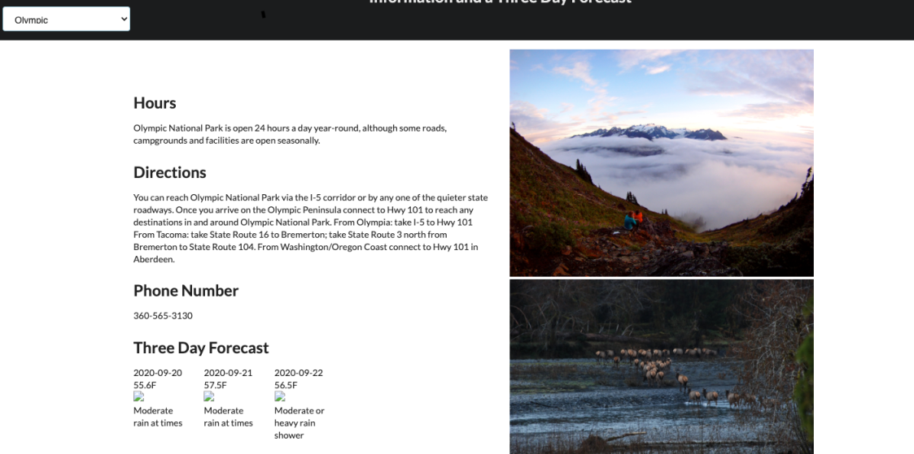
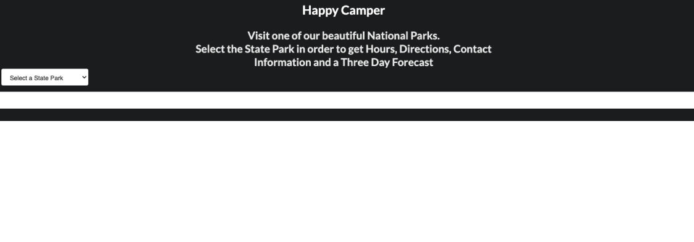

# Happy Campers

Happy Campers is a site to pull park information for major National Parks to visit. 

### Link to Repository and Live site
 

https://crazyjoeshow.github.io/Happy-Campers-Take2/
 
https://github.com/CrazyJoeShow/Happy-Campers-Take2
  

## The Application

The objective was to create a responsive website using semantic HTML, utilizing jQuery calls targeting 2 API's - National Park Service, and Open Weather App.
We took the the information returned from the API calls and dynamically added them to the page with the tools learned thus far in class. Park information is displayed, and a 3 day forecast for your convenience if you're planning a hike or camp.

## Process
Our process came to a halt when we we setup our API calls to append on the page. Long story short we had a template that was preventing us from using DOM manipulation in the manner we intended.
We completely overhauled the project to get to the website to the point where MVP is maintained and functionality of the site is working.
Joe had issues with branches on Github, and found out very fast that the process for creating the branches and merging upstream is VITAL. 

## Development and Technologies utilized

Our group learned so much during this project,  mainly communication and for me-Joe I learned that following directions every single step of the way is VITAL. 
-Github hosts our repo
-Git is the version control
-CSS to style the container
-HTML created DOM elements with
-javascript dynamically change the html on the DOM

 

 
## Screenshots
 

 

## Contributors
* Cameron Lay
* Eduardo Pineda
* Evelyn Goris
* Joseph Lowery

## Built Using

- [API](https://openweathermap.org/api)
- [API](https://www.nps.gov/subjects/developer/api-documentation.htm)
- [jQuery](https://api.jquery.com/)
- [javascript](https://cdnjs.com/libraries/semantic-ui)
- [HTML](https://developer.mozilla.org/en-US/docs/Web/HTML)
- [CSS](https://developer.mozilla.org/en-US/docs/Web/CSS)

 

 

## License
MIT License
Copyright (c) [2020] [Lay, Pineda, Goris, Lowery]
Permission is hereby granted, free of charge, to any person obtaining a copy
of this software and associated documentation files (the "Software"), to deal
in the Software without restriction, including without limitation the rights
to use, copy, modify, merge, publish, distribute, sublicense, and/or sell
copies of the Software, and to permit persons to whom the Software is
furnished to do so, subject to the following conditions:
The above copyright notice and this permission notice shall be included in all
copies or substantial portions of the Software.
THE SOFTWARE IS PROVIDED "AS IS", WITHOUT WARRANTY OF ANY KIND, EXPRESS OR
IMPLIED, INCLUDING BUT NOT LIMITED TO THE WARRANTIES OF MERCHANTABILITY,
FITNESS FOR A PARTICULAR PURPOSE AND NONINFRINGEMENT. IN NO EVENT SHALL THE
AUTHORS OR COPYRIGHT HOLDERS BE LIABLE FOR ANY CLAIM, DAMAGES OR OTHER
LIABILITY, WHETHER IN AN ACTION OF CONTRACT, TORT OR OTHERWISE, ARISING FROM,
OUT OF OR IN CONNECTION WITH THE SOFTWARE OR THE USE OR OTHER DEALINGS IN THE
SOFTWARE.